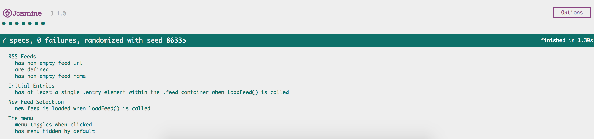

# Feed Reader Testing using Jasmine
This project explores writing test suites, using [Jasmine](https://jasmine.github.io/), against a pre-existing [web application](https://github.com/udacity/frontend-nanodegree-feedreader) that reads RSS feeds. The test suite tests the underlying business logic of the application as well as the event handling and DOM manipulation.

## Description of Tests
`feedreader.js` contains four test suites that are run against the application. For each test suite, a detailed description of specs and their corresponding test is given below.

### RSS Feeds
- `'has non-empty feed url'`: A test that loops through each feed in the `allFeeds` object and ensures it has a URL defined and that the URL is not empty.
- `'has non-empty feed name'`: A test that loops through each feed in the `allFeeds` object and ensures it has a name defined and that the name is not empty.

### The menu
- `'has menu hidden by default'`: A test that ensures the menu element is hidden by default. This includes analyzing the HTML, CSS and JavaScript to determine how the app is performing hiding/showing of the menu element.
- `'menu toggles when clicked'`: A test that ensures the menu changes visibility when the menu icon is clicked. This test has two expectations; does the menu display when clicked and does it hide when clicked again. Click events for menu icon are programmatically generated for this test.

### Initial Entries
- `'has at least a single .entry element within the .feed container when loadFeed() is called'`:  A test that ensures when the `loadFeed` function is called and completes its work, there is at least a single `.entry` element within the `.feed` container. 

### New Feed Selection
- `'new feed is loaded when loadFeed() is called'`: A test that ensures when a new feed is loaded by the `loadFeed` function that the content actually changes. 

No test is dependent on the results of another.

## Testing Asynchronous Code
Out of the four test suites described above, two suites([Initial Entries](#initial-entries) and [New Feed Selection](#new-feed-selection)) involve testing asynchronous components.

Jasmine supports 3 ways of managing asynchronous code: callbacks, Promises, and the `async` keyword. In this project, **callbacks** are used to signal the completion of asynchronous work to Jasmine framework. More specifically, `loadfeed()` function takes a callback as an argument and invokes it(irrespective of AJAX request success or failue) at the completion of AJAX request. In [Initial Entries](#initial-entries) suite, `done` is passed as callback argument. This ensure that feed is loaded before `.entry` element presence is tested. 
For [New Feed Selection](#new-feed-selection) suite, two successive `loadfeed()` invokations are required to verify content change. This is accomplished by having 2nd `loadfeed()` invokation as part of callback for first `loadfeed()` invokation and passing `done` as callback for 2nd `loadfeed()` invokation. This allows to capture feed content after each `loadfeed()` invokation and also to signal the testing framework the completion of asynchronous work.

## Built with
- [Jasmine](https://jasmine.github.io/) - A behavior-driven development framework for testing JavaScript code.
- [HTMLElement.click()](https://developer.mozilla.org/en-US/docs/Web/API/HTMLElement/click) - Simulates a mouse click on an element.

## How to run tests
- Click "Clone or download" / "Download ZIP".
- Open the folder and open `index.html` in browser.
- Test results are available at the bottom of the screen(see sample below). Specs with passing tests show as green; specs with failing tests show as red.

